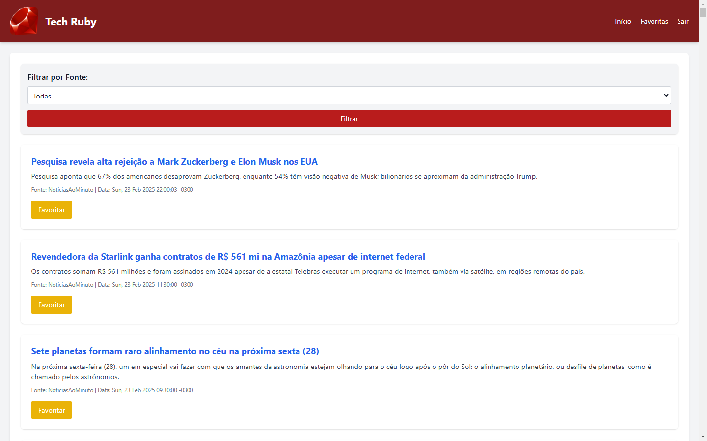

# Tech Ruby

Um feed de noticias sobre tecnologia de diferentes fontes


## Tecnologias Utilizadas
- [Ruby] - Linguagem Utilizada
- [Sinatra](http://sinatrarb.com/) - Framework para desenvolvimento de aplicativos web em Ruby.
- [RRR](https://github.com/wwhiteley/rrs) - Gem para gerar rotas dinâmicas de forma simples.
- [Nokogiri](https://nokogiri.org/) - Gem para análise e manipulação de documentos HTML e XML.
- [SQLite3](https://www.sqlite.org/index.html) - Banco de dados leve utilizado para armazenar dados.
- [Will Paginate](https://github.com/mislav/will_paginate) - Gem para paginação de resultados.

## Instalação

Siga os passos abaixo para rodar o projeto em seu ambiente local:

1. **Clone o repositório**

    ```bash
    git clone https://github.com/Jmspter/Tech.Ruby.git
    ```

2. **Instale as dependências**

    Certifique-se de ter o [Ruby](https://www.ruby-lang.org/en/documentation/installation/) instalado. Em seguida, instale as dependências do projeto:

    ```bash
    bundle install
    ```

    Se você não tiver o Bundler instalado, instale-o com:

    ```bash
    gem install bundler
    ```

3. **Configure o banco de dados**

    ```bash
    ruby db_setup.rb
    ```

4. **Execute o servidor**

    Com tudo configurado, você pode iniciar o servidor Sinatra com o seguinte comando:

    ```bash
    ruby app.rb
    ```

    O servidor será iniciado no `http://localhost:4567`.

## Uso

A aplicação fornece noticias sobre tecnologia e a opção para o usuario favoritar algumas delas.


1. Abra o navegador e vá para `http://localhost:4567`.
2. Você já pode ler as materias, porem caso queira favoritar um artigo primeiro vá em `Registrar`.
3. Apos o registro você poderar fovoritar materias e velas em favoritos.


## Licença


Este projeto é licenciado sob a Licença MIT - veja o arquivo [LICENSE.md](LICENSE.md) para mais detalhes.

